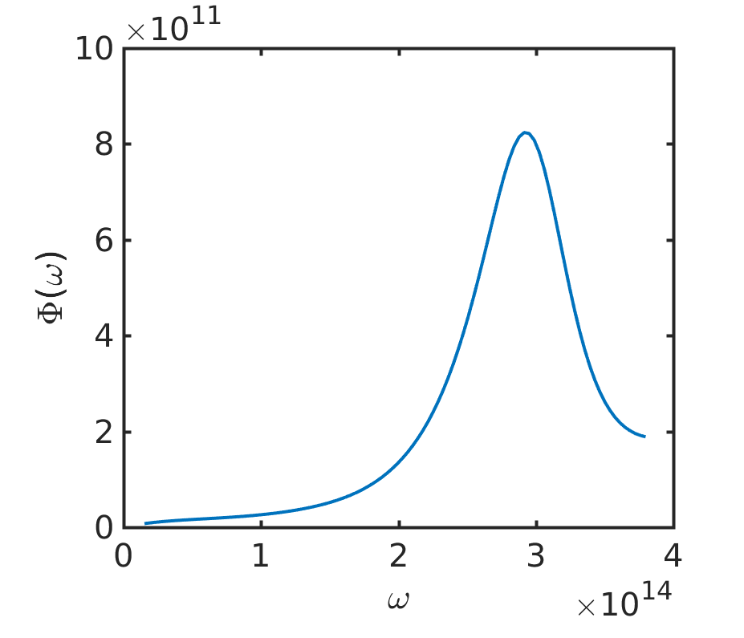

The following is an example with a mixed pattern on one layer. The layer `SiTop` has two patterns: (1) a rectangle patten centered at (250 nm, 250 nm) with widths (300 nm, 300 nm), and (2) a circle pattern centered at (750 nm, 750 nm) with radius 200 nm. Note that MESH has a contraint that patterns cannot interleave with each other.

```lua

s = SimulationPattern.new();
s:SetLattice(1e-6, 1e-6, 90);
s:SetNumOfG(441);

s:AddMaterial("Si", "Si.txt");
s:AddMaterial("Vacuum", "Vacuum.txt");

s:AddLayer("SiBottom", 0, "Si");
s:AddLayer("VacGap", 1e-7, "Vacuum");
s:AddLayer("SiTop", 0, "Si");
s:SetLayerPatternRectangle("SiTop", "Vacuum", {2.5e-7, 2.5e-7}, 0, {3e-7, 3e-7});
s:SetLayerPatternCircle("SiTop", "Vacuum", {7.5e-7, 7.5e-7}, 2e-7);


s:SetSourceLayer("SiBottom");
s:SetProbeLayer("VacGap");
s:OutputSysInfo();

s:OptPrintIntermediate();
s:SetKxIntegral(100);
s:SetKyIntegral(100);
s:InitSimulation();
s:IntegrateKxKy();

```
The result is
