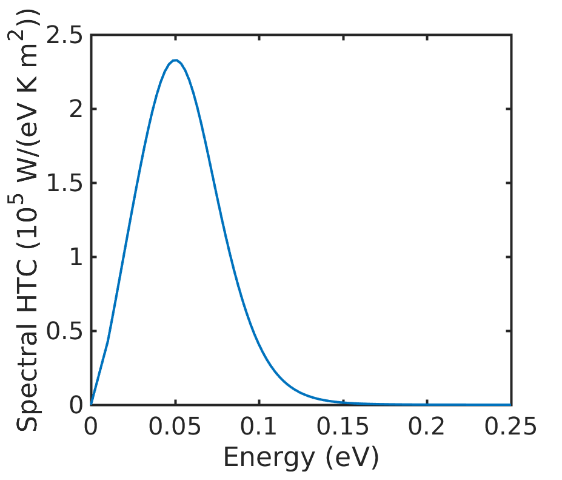

This is an example for Fig.2 (b) black curve in [arXiv:1701.02986](https://arxiv.org/abs/1701.02986).
```lua
constants = Constants();

function thetaDerivative(omega, T)
  local theta = constants.h_bar * omega / (math.exp(constants.h_bar * omega/constants.k_B/T) - 1);
  return math.pow(theta, 2) * math.exp(constants.h_bar * omega/constants.k_B/T) /constants.k_B / math.pow(T, 2);
end

f = 0.98;
width = math.sqrt(f * 50e-9 * 50e-9);
s = SimulationPattern.new();
s:SetLattice(50e-9, 50e-9, 90);
s:SetNumOfG(440);

s:AddMaterial("Si", "Si.txt");
s:AddMaterial("Vacuum", "Vacuum.txt");
s:AddLayer("SiBottom", 0, "Si");
s:SetLayerPatternRectangle("SiBottom", "Vacuum", {25e-9, 25e-9}, 0, {width, width});
s:AddLayer("VacGap", 20e-9, "Vacuum");
s:AddLayerCopy("SiTop", "SiBottom");

s:SetSourceLayer("SiBottom");
s:SetProbeLayer("VacGap");
s:OutputSysInfo();

s:OptPrintIntermediate();
s:SetKxIntegralSym(50);
s:SetKyIntegralSym(50);
s:InitSimulation();
s:IntegrateKxKy();

phi = s:GetPhi();
omega = s:GetOmega();
for i = 1,s:GetNumOfOmega(), 1 do
  print(string.format("%e", omega[i]).."\t"..string.format("%e", phi[i]));
end
```

The results is shown below
