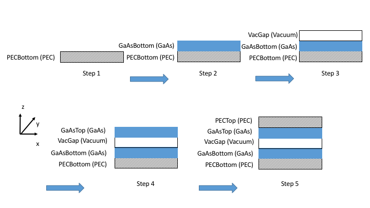
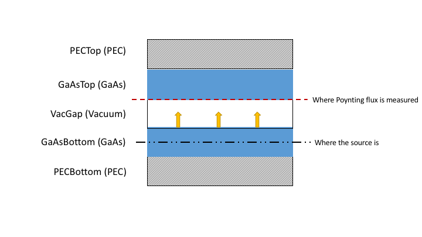

This is an detailed tutorial on the near-field heat transfer between two GaAs slabs backed with PEC.

#### 0. Initialize simulation object
First, to initialize the planar simulation, one should do
```lua
s = SimulationPlanar.new()
```

#### 1. Read input material files
First, one should add materials to the system, and the materials are initialized by the input files.
```lua
s:AddMaterial("GaAs", "GaAs.txt")
s:AddMaterial("PEC", "PEC.txt")
s:AddMaterial("Vacuum", "Vacuum.txt")
```
Here we initialize three materials `GaAs`, `PEC` and `Vacuum`, and their dielectric constants are contained in the files `GaAs.txt`, `PEC.txt` and `Vacuum.txt`, respectively. Here is a glance at the top few lines of `GaAs.txt` file:
```tex
2.126978e+15	1.306099e+01	1.228760e-02
2.131253e+15	1.307147e+01	2.845717e-02
2.135527e+15	1.308195e+01	4.462674e-02
2.139802e+15	1.309243e+01	6.079631e-02
2.144077e+15	1.310291e+01	7.696587e-02
    ...             ...              ...
```
where the data is specified in $\omega, \epsilon_r, \epsilon_i$ fashion, separated by tab, with in total $199$ rows. All material files should contain the dielectric function at the same omega values. For PEC, one needs to use a very large $\epsilon$ value for it be to reflective, and Vacuum needs to have a very small imaginary part (here $10^{-10}$) to maintain numerical stability. In addition, make sure that all the `.txt`  files are the in the same directory as the `.lua` script.

#### 2. Add layers to the system
```lua
s:AddLayer("PECBottom", 0, "PEC");
s:AddLayer("GaAsBottom", 1e-6, "GaAs");
s:AddLayer("VacGap", 1e-8, "Vacuum");
s:AddLayerCopy("GaAsTop", "GaAsBottom");
s:AddLayerCopy("PECTop", "PECBottom");
```
Here there are in total $5$ layers that has been added to the system: `PECBottom`, `GaAsBottom`, `VacGap`, `GaAsTop` and `PECTop`. Different from [S4](https://web.stanford.edu/group/fan/S4/), here the layers are built from bottom to the top, with the bottom most and top most layers being semi-infinite (set thickness to $0$ here). The following is a drawing illustrating how the layers are added to the system:


#### 3. Set source and probe, as well as options
```lua
s:SetSourceLayer("GaAsBottom");
s:SetProbeLayer("VacGap");
s:OptUseQuadgk();
s:SetKParallelIntegral(10);
s:SetThread(4);
```
In this case, since we are simulating the heat transfer between the two GaAs layers, we set the layer `GaAsBottom` as the source layer, and `VacGap` to be the probe layer where Poynting vector is measured. Here, one needs to ensure that the source layer is always below the probe layer in the system. The following figure is an illustration after the source and probe layers are set.


#### 4. Build simulation and perform integration
Now, with the system built up and the integral set up, one can build RCWA matrices and perform integration over $k_{\parallel}$.
```lua
s:BuildRCWA();
s:IntegrateKParallel();
```

#### 5. Print results
```lua
phi = s:GetPhi();
omega = s:GetOmega();
for i = 1,s:GetNumOfOmega(), 1 do
  print(string.format("%e", omega[i]).."\t"..string.format("%e", phi[i]));
end
```
The above is a simple way to retrieve the result and print it to the screen. One can also use Lua built-in i/o functions to output result into files.

Now save this file as `main.lua`, and one can simply type
```bash
mesh main.lua
```
to run the simulation.